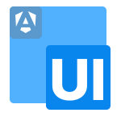

# BlockUI - Angular UI-Components

  

BlockUI is a collection of Angular UI components designed to enhance user experience by providing a consistent and visually appealing interface which is completely customizable.

### Components
The following components are currently available in BlockUI:
- Custom file input (supporting image preview, multiple files, predefined file types, and more)
- Modal dialogs (supporting custom content and actions)
- Custom select dropdowns (supporting search, multiple selections, and more)
- Toggles (supporting custom events)
- Custom Video Player (with custom controls and keyboard shortcuts)
- Math Expressions via Katex (supporting LaTeX syntax for mathematical expressions)

More Components are planned for future releases.

### Customization
All components in BlockUI are designed to be easily customizable. 
You can modify styles with CSS variables and implement custom events to suit your application's needs.

### Preview
A live preview of the components is already implemented in the app.component. 
Just clone the repository, install the dependencies, and run the application to see the components in action.
